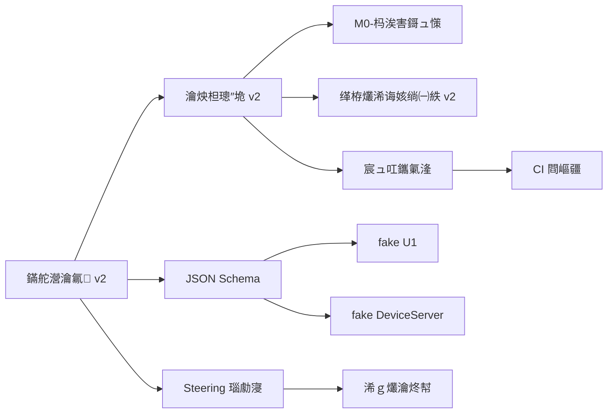

# 鍏ㄥ眬瑙勫垝 - Planning with Files

**鐗堟湰**锛歷1.0
**鍒涘缓鏃ユ湡**锛?026-05-14
**鐘舵€?*锛氭墽琛屼腑
**渚濇嵁鏂囨。**锛氭灦鏋勫畾绋?v2, 瀹炴柦璁″垝 v2, Superpowers 鍘熷垯

## 鐩綍

- [1. 椤圭洰鎬昏](#1-椤圭洰鎬昏)
- [2. 閲岀▼纰戣矾绾垮浘](#2-閲岀▼纰戣矾绾垮浘)
- [3. 鏂囦欢缁勭粐缁撴瀯](#3-鏂囦欢缁勭粐缁撴瀯)
- [4. 褰撳墠杩涘害](#4-褰撳墠杩涘害)
- [5. 涓嬩竴姝ヨ鍔╙(#5-涓嬩竴姝ヨ鍔?
- [6. 渚濊禆鍏崇郴鍥綸(#6-渚濊禆鍏崇郴鍥?
- [7. 椋庨櫓涓庣紦瑙(#7-椋庨櫓涓庣紦瑙?

---

## 1. 椤圭洰鎬昏

### 1.1 椤圭洰瀹氫綅

**esp32S_XYZ** - 鍎跨/瀹跺涵鍒涙剰鏁欒偛鏅鸿兘鍐欏瓧鏈?鐢诲浘鏈?

- **鍟嗕笟妯″紡**锛氱‖浠朵拱鏂?+ AI 鐢熸垚鑳藉姏/瀛椾綋璁㈤槄
- **鐩爣鐢ㄦ埛**锛欳 绔搴敤鎴凤紙瀹堕暱缁欏瀛愩€佹垚浜鸿嚜璐?閫佺ぜ锛?
- **瀹㈡埛绔?*锛氬井淇″皬绋嬪簭浼樺厛
- **鏍稿績鑳藉姏**锛氬啓瀛椼€佺敾鍥俱€佽闊充氦浜掋€丄I 鐢熸垚

### 1.2 绯荤粺鏋舵瀯

```
Client (灏忕▼搴?
    鈫?Edge-A (WSS/HTTPS)
BusinessServer (manager-api)
    鈫?Edge-B (鍐呴儴 HTTP)
DeviceServer (xiaozhi-server)
    鈫?Edge-C (WSS)
U8 (AI_MCU, ESP32-S3)
    鈫?Edge-D (UART @{json}\n)
U1 (MOTOR_MCU, ESP32-S3)
```

### 1.3 鏍稿績鍘熷垯

- **Superpowers 鍘熷垯**锛氬厛楠岃瘉鍚庡疄鐜帮紝灏芥棭鏀舵暃涓嶇‘瀹氭€?
- **鏂囨。鍏堣**锛氭灦鏋勫畾绋?v2 鈫?瀹炴柦璁″垝 v2 鈫?浠ｇ爜瀹炵幇
- **鍙岄噸瀹夊叏瑁佸喅**锛欱usinessServer 鍓嶇疆 + U1 鏈€缁堣鍐?
- **浠ｇ爜鏂囨。鍚屾**锛氭瘡娆℃彁浜ゅ繀椤诲悓鏃舵洿鏂版枃妗?

---

## 2. 閲岀▼纰戣矾绾垮浘

### 2.1 鎬诲浘

```
M0  璁捐鏈熼獙璇侊紙鏃犱富鏉垮彲鍋氾級           鈫?褰撳墠浣嶇疆
    M0a 鉁?濂戠害鍥哄寲锛圝SON Schema锛?
    M0b 鉁?闈欐€佹鏌ワ紙GPIO 鍐茬獊銆乻trapping pin锛?
    M0c 鈴?浠跨湡鍣紙fake U1 鉁呫€乫ake DeviceServer銆乫ake AI锛?
    M0d 鈴?CI 涓庡崟鍏冩祴璇曢鏋?
    M0e 鉁?鍩哄噯淇
    M0f 鈴革笍 瀹炵墿涓婄數鎶芥祴锛堢瓑瀹炵墿锛?

M1  璁惧鍗忚绔埌绔?(GET_STATUS/HOME/MOVE)
M2  灏忕▼搴忚闃呴摼璺墦閫?(run_path 鍙)
M3  write_text/draw 鎶曞奖绔埌绔?
M4  璇煶瑙﹀彂 + 澹扮汗
M5  OTA / 閰嶇綉 / 鑷
M6  涓婄嚎鍚堣涓庤繍钀ョ骇鍔熻兘
```

### 2.2 閲岀▼纰戣鎯?

| 閲岀▼纰?| 鐩爣 | 鍓嶇疆鏉′欢 | 瀹屾垚鍒ゅ畾 | 棰勮宸ユ湡 |
|--------|------|----------|----------|----------|
| **M0** | 璁捐鏈熼獙璇?| 鏃?| 鎵€鏈?fake 鐜鍙敤锛孋I 鍏ㄧ豢 | 2 鍛?|
| **M1** | 璁惧鍗忚绔埌绔?| M0c.1 fake U1 | U8 鈫?U1 涓夋潯鍛戒护閫?| 2 鍛?|
| **M2** | 灏忕▼搴忚闃呴摼璺?| M1 + M0c.2 | 灏忕▼搴忕湅鍒拌澶囩姸鎬佸彉鍖?| 3 鍛?|
| **M3** | 鎶曞奖绠＄嚎 | M2 | 鍐欏瓧/鐢诲浘绔埌绔?| 3 鍛?|
| **M4** | 璇煶瑙﹀彂 | M3 + M0c.3 | 璇煶璇磋瘽鑳藉啓瀛楃敾鍥?| 2 鍛?|
| **M5** | OTA/閰嶇綉/鑷 | M4 | 璁惧鍙仈缃戙€佸彲鍗囩骇 | 2 鍛?|
| **M6** | 涓婄嚎鍚堣 | M5 | 閫氳繃灏忕▼搴忓鏍?| 2 鍛?|

---

## 3. 鏂囦欢缁勭粐缁撴瀯

### 3.1 鏍稿績鏂囨。

```
docs/
鈹溾攢鈹€ 鏋舵瀯瀹氱-v2.md              # 鏋舵瀯瑙勮寖锛圥0锛屾墍鏈夊喅绛栫殑鍩哄噯锛?
鈹溾攢鈹€ 瀹炴柦璁″垝-v2.md              # 瀹炴柦璁″垝锛圥0锛孧0-M6 璇︾粏姝ラ锛?
鈹溾攢鈹€ M0-杩涘害鎶ュ憡.md              # M0 杩涘害璺熻釜
鈹溾攢鈹€ 鍏ㄥ眬瑙勫垝-Planning-with-Files.md  # 鏈枃浠?
鈹溾攢鈹€ 缂栫爜浠诲姟绱㈠紩-v2.md          # 浠诲姟绱㈠紩
鈹溾攢鈹€ ui-template.md              # 灏忕▼搴?UI 妯℃澘閫夊瀷
鈹溾攢鈹€ 纭欢杩炴帴涓嶨PIO鍒嗛厤璇存槑.md   # 纭欢鏂囨。
鈹溾攢鈹€ 纭欢鏍稿鎶ュ憡.md             # 纭欢楠岃瘉
鈹溾攢鈹€ U1-Grbl閫傞厤璇存槑.md          # U1 鍥轰欢閫傞厤
鈹斺攢鈹€ schemas/                    # JSON Schema锛圡0a锛?
    鈹溾攢鈹€ README.md
    鈹溾攢鈹€ edge_a/                 # Client 鈫?BusinessServer
    鈹溾攢鈹€ edge_b/                 # BusinessServer 鈫?DeviceServer
    鈹溾攢鈹€ edge_c/                 # DeviceServer 鈫?U8
    鈹斺攢鈹€ edge_d/                 # U8 鈫?U1
```

### 3.2 Steering 瑙勮寖

```
.kiro/steering/
鈹溾攢鈹€ README.md                   # Steering 鎬昏
鈹溾攢鈹€ ui-ux-pro-max.md           # UI/UX 鍏ㄥ眬瑙勮寖
鈹溾攢鈹€ code-review.md             # 浠ｇ爜瀹℃煡瑙勮寖
鈹溾攢鈹€ code-simplifier.md         # 浠ｇ爜绠€鍖栬鑼?
鈹溾攢鈹€ code-doc-sync.md           # 浠ｇ爜鏂囨。鍚屾瑙勮寖
鈹溾攢鈹€ skill-creator.md           # 鎶€鑳藉垱寤鸿鑼?
鈹溾攢鈹€ protocol-design.md         # 鍗忚璁捐 Skill
鈹溾攢鈹€ safety-validation.md       # 瀹夊叏瑁佸喅 Skill
鈹溾攢鈹€ projection-pipeline.md     # 鎶曞奖绠＄嚎 Skill
鈹溾攢鈹€ voice-intent.md            # 璇煶鎰忓浘 Skill
鈹溾攢鈹€ tdd.md                     # 娴嬭瘯椹卞姩寮€鍙?Skill
鈹溾攢鈹€ fake-environment.md        # fake 鐜 Skill
鈹斺攢鈹€ milestone-acceptance.md    # 閲岀▼纰戦獙鏀?Skill
```

### 3.3 宸ュ叿涓庢祴璇?

```
tools/
鈹溾攢鈹€ check_gpio.py              # GPIO 闈欐€佹鏌ワ紙M0b 鉁咃級
鈹溾攢鈹€ test_check_gpio.py         # GPIO 妫€鏌ュ崟鍏冩祴璇?
鈹溾攢鈹€ README.md                  # 宸ュ叿浣跨敤鏂囨。
鈹斺攢鈹€ fake_u1/                   # fake U1 浠跨湡鍣紙M0c.1 鉁咃級
    鈹溾攢鈹€ fake_u1.py             # 浠跨湡鍣ㄤ富绋嬪簭
    鈹溾攢鈹€ test_fake_u1.py        # 鍗曞厓娴嬭瘯锛?3/13 閫氳繃锛?
    鈹斺攢鈹€ README.md              # 浣跨敤鏂囨。
```

### 3.4 鍥轰欢浠ｇ爜

```
firmware/
鈹溾攢鈹€ u1-grbl/                   # U1 鍥轰欢锛圙rbl_Esp32锛?
鈹?  鈹斺攢鈹€ Grbl_Esp32/src/
鈹?      鈹溾攢鈹€ Machines/dlc_motor_control_p1.h  # U1 GPIO 閰嶇疆
鈹?      鈹溾攢鈹€ Report.cpp         # 鐘舵€佷笂鎶ワ紙M1.2, M1.3锛?
鈹?      鈹斺攢鈹€ Protocol.cpp       # 绉佹湁鍗忚澶勭悊锛圡1.5锛?
鈹斺攢鈹€ u8-xiaozhi/                # U8 鍥轰欢
    鈹斺攢鈹€ main/boards/zhuguang/dlc-motor-control-p1-ai/
        鈹溾攢鈹€ config.h           # U8 GPIO 閰嶇疆
        鈹斺攢鈹€ dlc_motor_control_p1_ai_board.cc  # 鏉跨骇瀹炵幇
```

### 3.5 鏈嶅姟绔唬鐮?

```
server/xiaozhi-esp32-server/main/
鈹溾攢鈹€ manager-api/               # BusinessServer (Java/Spring)
鈹?  鈹斺攢鈹€ src/main/
鈹?      鈹溾攢鈹€ resources/db/changelog/  # 鏁版嵁搴撹縼绉伙紙M2.1锛?
鈹?      鈹斺攢鈹€ java/.../
鈹?          鈹溾攢鈹€ controller/    # REST API锛圡2.2锛?
鈹?          鈹溾攢鈹€ service/       # 涓氬姟閫昏緫
鈹?          鈹斺攢鈹€ ws/            # WebSocket锛圡2.7锛?
鈹溾攢鈹€ xiaozhi-server/            # DeviceServer (Python)
鈹?  鈹斺攢鈹€ core/
鈹?      鈹溾攢鈹€ handle/            # 娑堟伅澶勭悊锛圡2.4锛?
鈹?      鈹溾攢鈹€ api/               # HTTP API
鈹?      鈹斺攢鈹€ websocket_server.py  # WSS 鏈嶅姟鍣?
鈹斺攢鈹€ manager-mobile/            # 灏忕▼搴?(uni-app)
    鈹斺攢鈹€ src/
        鈹溾攢鈹€ pages/             # 椤甸潰锛圡2.8锛?
        鈹斺攢鈹€ utils/             # 宸ュ叿鍑芥暟
```

---

## 4. 褰撳墠杩涘害

### 4.1 宸插畬鎴愶紙鉁咃級

#### M0a 濂戠害鍥哄寲
- 鉁?`docs/schemas/` 鍏ㄩ儴 schema 鏂囦欢
- 鉁?Edge-A/B/C/D 鍥涙潯杈圭晫鐨勫崗璁畾涔?
- 鉁?姣忔潯 capability銆乪vent銆佸懡浠ゃ€佸搷搴旈兘鏈?schema

#### M0b 闈欐€佹鏌?
- 鉁?`tools/check_gpio.py` - GPIO 闈欐€佹鏌ュ伐鍏?
- 鉁?`tools/test_check_gpio.py` - 8/8 鍗曞厓娴嬭瘯閫氳繃
- 鉁?鐪熷疄閰嶇疆妫€鏌ラ€氳繃锛? 閿欒锛? 璀﹀憡锛? 淇℃伅锛?- 鉁?GPIO38/39/40 宸茬敱 PADS `.txt` 婧愭枃浠舵牳鍒?U8.31/32/33锛屼笉鍐嶄綔涓哄急璇?- 鉁?鏀硅繘 strapping pin 妫€鏌ラ€昏緫

#### M0c.1 fake U1
- 鉁?`tools/fake_u1/fake_u1.py` - 浠跨湡鍣ㄤ富绋嬪簭
- 鉁?`tools/fake_u1/test_fake_u1.py` - 13/13 鍗曞厓娴嬭瘯閫氳繃
- 鉁?瀹屾暣鐘舵€佹満锛? 绉嶇姸鎬侊級
- 鉁?10 绉嶅懡浠ゆ敮鎸?
- 鉁?4 绉嶉敊璇敞鍏?

#### M0e 鍩哄噯淇
- 鉁?U8 config.h TX/RX 淇
- 鉁?纭欢鏂囨。璇佹嵁寮哄害鏍囨敞
- 鉁?v1 鏂囨。澶辨晥澹版槑

### 4.2 杩涜涓紙鈴筹級

#### M0c.2 fake DeviceServer
- 鈴?寰呭疄鐜?
- 浼樺厛绾э細P2锛圔usinessServer 绔紑鍙戜緷璧栵級

#### M0c.3 fake AI provider
- 鈴?寰呭疄鐜?
- 浼樺厛绾э細P2锛圡3/M4 寮€鍙戜緷璧栵級

#### M0d CI 涓庡崟鍏冩祴璇曢鏋?
- 鉁?`.github/workflows/ci.yml` - CI 閰嶇疆楠ㄦ灦
- 鉁?`gpio-check` job - GPIO 闈欐€佹鏌?
- 鉁?`python-unit` job - Python 鍗曞厓娴嬭瘯
- 鉁?`schema-validate` job - JSON Schema 鏍￠獙
- 鉁?`fake-integration` job - Fake 鐜闆嗘垚娴嬭瘯
- 鉁?`markdown-link-check` job - Markdown 閾炬帴妫€鏌?
### 4.3 绛夊緟涓紙鈴革笍锛?

#### M0f 瀹炵墿涓婄數鎶芥祴
- 鈴革笍 绛夊疄鐗╋紝涓嶉樆濉?M1~M3 杞欢璁捐
- 浣滀负 M1 杩涘叆"鐪熷疄纭欢鑱旇皟"鐨勫己鍓嶇疆

---

## 5. 涓嬩竴姝ヨ鍔?

### 5.1 绔嬪嵆鎵ц锛圥0锛?

**鏃?* - 褰撳墠鎵€鏈?P0 浠诲姟宸插畬鎴?

### 5.2 鐭湡璁″垝锛圥1锛?

#### 1. 瀹屽杽 M0d CI锛堥璁?2 澶╋級

**鐩爣**锛氳 GitHub Actions 24 灏忔椂瀹堟姢浠ｇ爜璐ㄩ噺

**浠诲姟**锛?
- [x] 瀹炵幇 `schema-validate` job
  - 鏂囦欢锛歚.github/workflows/ci.yml`
  - 宸ュ叿锛歚jsonschema` 搴?
  - 鏍￠獙锛歚docs/schemas/` 鍏ㄩ儴鏍蜂緥

- [x] 瀹炵幇 `fake-integration` job
  - 鐢?fake U1 璺戠鍒扮闆嗘垚娴嬭瘯
  - 瑕嗙洊锛欸ET_STATUS/HOME/MOVE/run_path 鍚?1 鏉?happy path

- [x] 瀹炵幇 `markdown-link-check` job
  - 淇濊瘉 v2 鏂囨。鍐呴儴閿氱偣涓嶈厫鍧?

- [ ] 閰嶇疆 GitHub required checks
  - PR 蹇呴』 5 涓?job 鍏ㄧ豢鎵嶅彲鍚堝苟

**瀹屾垚鍒ゅ畾**锛?- 鉁?鏈湴绛変环 CI 鍛戒护鍏ㄧ豢
- [ ] GitHub main 鍒嗘敮 CI 鍏ㄧ豢
- [ ] PR 鏈?required check 淇濇姢

#### 2. 鍑嗗 M1 寮€鍙戠幆澧冿紙棰勮 1 澶╋級

**鐩爣**锛氫负 M1 璁惧鍗忚绔埌绔仛鍑嗗

**浠诲姟**锛?
- [ ] 楠岃瘉 fake U1 涓?U8 鐨勮繛鎺?
  - 鍚姩 fake U1 鏈嶅姟鍣?
  - 閰嶇疆 U8 杩炴帴鍒?fake U1
  - 鍙戦€佹祴璇曞懡浠?

- [ ] 鍑嗗 M1.1 Edge-D 鏍蜂緥闆?
  - 宸叉湁锛歚docs/schemas/edge_d/examples/` 7 涓牱渚?
  - 楠岃瘉锛歠ake U1 涓?U8 鍗曟祴閮藉紩鐢ㄥ悓涓€鎵规牱渚?

**瀹屾垚鍒ゅ畾**锛?
- 鉁?U8 鑳借繛鎺ュ埌 fake U1
- 鉁?鑳藉彂閫?GET_STATUS 骞舵敹鍒板搷搴?

### 5.3 涓湡璁″垝锛圥2锛?

#### 3. 瀹炵幇 M0c.2 fake DeviceServer锛堥璁?3 澶╋級

**鐩爣**锛氳 BusinessServer 绔紑鍙戜笉蹇呯瓑鐪?xiaozhi-server 鏀归€?

**浠诲姟**锛?
- [ ] 鍒涘缓 `tools/fake_device_server/` 鐩綍
- [ ] 瀹炵幇鏈€灏?WebSocket server
- [ ] 瀹炵幇 HTTP 鎺ユ敹 motion_task
- [ ] 杞彂缁?fake U1
- [ ] 鍙嶅悜涓婃姤 motion_event

**瀹屾垚鍒ゅ畾**锛?
- 鉁?BusinessServer 绔崟鍏冩祴璇曠敤瀹冨仛闆嗘垚 fake
- 鉁?涓嶄緷璧栫湡 Python 涓婃父

#### 4. 瀹炵幇 M0c.3 fake AI provider锛堥璁?2 澶╋級

**鐩爣**锛歁3/M4 闃舵涓嶄緷璧栫湡 LLM/ASR/TTS

**浠诲姟**锛?
- [ ] 鍒涘缓 `tools/fake_ai/` 鐩綍
- [ ] 鍥哄畾鍥炲寘妯℃嫙 LLM
- [ ] 鍥哄畾鏂囧瓧妯℃嫙 ASR
- [ ] 闈欓粯闊抽妯℃嫙 TTS

**瀹屾垚鍒ゅ畾**锛?
- 鉁?DeviceServer 鍦?ai_plan = `plan_basic` 鏃惰皟瀹冭€岄潪鐪熷疄 provider

---

## 6. 渚濊禆鍏崇郴鍥?

### 6.1 閲岀▼纰戜緷璧?

```mermaid
graph TD
    M0[M0 璁捐鏈熼獙璇乚 --> M1[M1 璁惧鍗忚绔埌绔痌
    M1 --> M2[M2 灏忕▼搴忚闃呴摼璺痌
    M2 --> M3[M3 鎶曞奖绠＄嚎]
    M3 --> M4[M4 璇煶瑙﹀彂]
    M4 --> M5[M5 OTA/閰嶇綉/鑷]
    M5 --> M6[M6 涓婄嚎鍚堣]

    M0a[M0a 濂戠害鍥哄寲] --> M1
    M0b[M0b 闈欐€佹鏌 --> M0f[M0f 瀹炵墿涓婄數]
    M0c1[M0c.1 fake U1] --> M1
    M0c2[M0c.2 fake DeviceServer] --> M2
    M0c3[M0c.3 fake AI] --> M3
    M0d[M0d CI 楠ㄦ灦] --> M1
    M0f --> M1_real[M1 鐪熷疄纭欢鑱旇皟]
```

### 6.2 鏂囦欢渚濊禆



### 6.3 浠ｇ爜渚濊禆

```mermaid
graph TD
    Client[灏忕▼搴廬 -->|Edge-A| BS[BusinessServer]
    BS -->|Edge-B| DS[DeviceServer]
    DS -->|Edge-C| U8[U8 鍥轰欢]
    U8 -->|Edge-D| U1[U1 鍥轰欢]

    FU1[fake U1] -.鏇夸唬.-> U1
    FDS[fake DeviceServer] -.鏇夸唬.-> DS
    FAI[fake AI] -.鏇夸唬.-> AI[AI Provider]
```

---

## 7. 椋庨櫓涓庣紦瑙?

### 7.1 楂橀闄╋紙闇€绔嬪嵆鍏虫敞锛?

| 椋庨櫓 | 姒傜巼 | 褰卞搷 | 褰撳墠鐘舵€?| 缂撹В鎺柦 |
|------|------|------|----------|----------|
| 涓绘澘鍒拌揣寤惰繜鍘嬬缉 M4~M6 鏃堕棿 | 涓?| 涓?| 鈿狅笍 鐩戞帶涓?| 鉁?M1~M3 鍏ㄥ湪浠跨湡鍣ㄤ笂鎺ㄨ繘锛岄伩鍏嶈蒋浠惰建琚‖浠堕樆濉?|
| PADS 婧愭枃浠朵笌瀹炵墿杩為€氫笉涓€鑷?| 涓?| 楂?| 鈿狅笍 绛?M0f | 鉁?M0b 宸茬敤 PADS `.txt` 鏀舵暃閰嶇疆锛汳0f 涓婃澘鏃舵娊娴?UART銆丼TEP/DIR銆両O38/39/40 |
| JSON Schema 涓庡疄鐜版紓绉?| 涓?| 涓?| 鈿狅笍 闇€ CI | 鈴?M0d CI 鏍￠獙 schema锛泇2 搂19.5 瀛楁婕旇繘瑙勫垯寮哄埗"鍏?schema 鍚庝唬鐮? |

### 7.2 涓闄╋紙闇€瀹氭湡妫€鏌ワ級

| 椋庨櫓 | 姒傜巼 | 褰卞搷 | 褰撳墠鐘舵€?| 缂撹В鎺柦 |
|------|------|------|----------|----------|
| fake U1 涓庣湡瀹?U1 琛屼负鍋忓樊 | 涓?| 涓?| 鉁?宸茶褰?| M0c.1 fake 鍙繚鐣欏崗璁涓猴紝绂佹浠跨湡鐪熷疄鐢垫満鐗╃悊锛汳0f 涓婃澘褰撳ぉ鍒?棣栨瀹炴満娓呭崟"浜ゅ弶楠岃瘉 |
| Grbl_Esp32 鍐呴儴 API 涓庨鏈熶笉绗?| 涓?| 涓?| 鈿狅笍 寰呴獙璇?| M1.1 鏃跺厛鍐?dryrun 鎺㈡祴 |
| 寰俊灏忕▼搴忓鏍歌鎵撳洖 | 涓?| 楂?| 鈴革笍 M6 | M6.1 鎻愬墠涓€涓湀寮€濮?|

### 7.3 浣庨闄╋紙宸茬紦瑙ｏ級

| 椋庨櫓 | 姒傜巼 | 褰卞搷 | 褰撳墠鐘舵€?| 缂撹В鎺柦 |
|------|------|------|----------|----------|
| GPIO 閰嶇疆閿欒瀵艰嚧纭欢鎹熷潖 | 浣?| 楂?| 鉁?宸茬紦瑙?| M0b 宸ュ叿宸插疄鐜帮紝鍙彁鍓嶅彂鐜?|
| 鍐呭瀹℃牳鏈嶅姟鍑洪棶棰?| 浣?| 楂?| 鈴革笍 M3 | 鍙屽眰锛堟湰鍦板叧閿瘝 + 浜戠璇箟锛?|
| 澹扮汗妯″瀷瀵瑰効绔ヨ瘑鍒巼浣?| 楂?| 涓?| 鈴革笍 M4 | v2 搂6ter.8 6 涓湀閲嶅綍 + 澶辫触闄嶇骇 |
| OTA 鐏板害閬囧ぇ闈㈢Н澶辫触 | 涓?| 鏋侀珮 | 鈴革笍 M5 | 鐏板害涓婇檺 10% 璧凤紝鐩戞帶瑙侀敊灏卞仠 |

---

## 8. 鍏抽敭鎸囨爣

### 8.1 杩涘害鎸囨爣

| 鎸囨爣 | 褰撳墠鍊?| 鐩爣鍊?| 鐘舵€?|
|------|--------|--------|------|
| M0 瀹屾垚搴?| 70% | 100% | 鈴?杩涜涓?|
| M0a 濂戠害鍥哄寲 | 100% | 100% | 鉁?瀹屾垚 |
| M0b 闈欐€佹鏌?| 100% | 100% | 鉁?瀹屾垚 |
| M0c 浠跨湡鍣?| 33% | 100% | 鈴?杩涜涓?|
| M0d CI 楠ㄦ灦 | 80% | 100% | 鈴?绛?GitHub required checks |
| M0e 鍩哄噯淇 | 100% | 100% | 鉁?瀹屾垚 |
| M0f 瀹炵墿鎶芥祴 | 0% | 100% | 鈴革笍 绛夊疄鐗?|

### 8.2 璐ㄩ噺鎸囨爣

| 鎸囨爣 | 褰撳墠鍊?| 鐩爣鍊?| 鐘舵€?|
|------|--------|--------|------|
| GPIO 妫€鏌ラ€氳繃鐜?| 100% | 100% | 鉁?杈炬爣 |
| fake U1 娴嬭瘯閫氳繃鐜?| 100% (13/13) | 100% | 鉁?杈炬爣 |
| CI 閫氳繃鐜?| 60% (3/5 jobs) | 100% | 鈴?鏀硅繘涓?|
| 鏂囨。鍚屾鐜?| 100% | 100% | 鉁?杈炬爣 |

### 8.3 鏁堢巼鎸囨爣

| 鎸囨爣 | 褰撳墠鍊?| 鐩爣鍊?| 鐘舵€?|
|------|--------|--------|------|
| 浠ｇ爜鎻愪氦棰戠巼 | 姣忓ぉ 2-3 娆?| 姣忓ぉ 2-3 娆?| 鉁?杈炬爣 |
| 鏂囨。鏇存柊寤惰繜 | 0 澶?| 0 澶?| 鉁?杈炬爣 |
| PR 鍚堝苟鏃堕棿 | N/A | < 1 澶?| - |
| CI 鎵ц鏃堕棿 | ~2 鍒嗛挓 | < 5 鍒嗛挓 | 鉁?杈炬爣 |

---

## 9. 鍥㈤槦鍗忎綔

### 9.1 瑙掕壊涓庤亴璐?

| 瑙掕壊 | 鑱岃矗 | 褰撳墠鐘舵€?|
|------|------|----------|
| 鏋舵瀯甯?| 缁存姢鏋舵瀯瀹氱 v2锛屽鏌ラ噸澶у彉鏇?| 鉁?娲昏穬 |
| 寮€鍙戣€?| 瀹炵幇浠ｇ爜锛岄伒寰?Steering 瑙勮寖 | 鉁?娲昏穬 |
| 娴嬭瘯鑰?| 缂栧啓鍗曞厓娴嬭瘯锛屾墽琛岄泦鎴愭祴璇?| 鉁?娲昏穬 |
| 鏂囨。缁存姢鑰?| 鍚屾鏇存柊鏂囨。锛屼繚鎸佹枃妗ｆ柊椴?| 鉁?娲昏穬 |

### 9.2 娌熼€氭満鍒?

- **鏃ュ父娌熼€?*锛氶€氳繃 Git commit message 鍜?PR 鎻忚堪
- **閲嶅ぇ鍐崇瓥**锛氭洿鏂版灦鏋勫畾绋?v2锛屾坊鍔犱慨璁㈣褰?
- **杩涘害鍚屾**锛氭洿鏂?M0-杩涘害鎶ュ憡.md
- **闂璺熻釜**锛欸itHub Issues锛堝緟寤虹珛锛?

### 9.3 浠ｇ爜瀹℃煡娓呭崟

鍙傝€?`.kiro/steering/code-review.md`锛?

- [ ] 瑙掕壊鑱岃矗姝ｇ‘锛埪? 浜旇鑹茶〃锛?
- [ ] 鍒嗗眰姝ｇ‘锛屾棤璺ㄥ眰鐩磋繛锛埪?.2锛?
- [ ] 鍙岄噸瀹夊叏瑁佸喅鐢熸晥锛埪?0bis锛?
- [ ] 鍗忚瀛楁绗﹀悎 schema
- [ ] 鏂囨。宸插悓姝ユ洿鏂?
- [ ] 娴嬭瘯宸查€氳繃

---

## 10. 鍙傝€冭祫鏂?

### 10.1 鏍稿績鏂囨。

- **鏋舵瀯瀹氱 v2**锛歚docs/鏋舵瀯瀹氱-v2.md`
- **瀹炴柦璁″垝 v2**锛歚docs/瀹炴柦璁″垝-v2.md`
- **Superpowers 鍘熷垯**锛歚.cursor/rules/superpowers-and-context.mdc`
- **M0 杩涘害鎶ュ憡**锛歚docs/M0-杩涘害鎶ュ憡.md`

### 10.2 Steering 瑙勮寖

- **UI/UX 瑙勮寖**锛歚.kiro/steering/ui-ux-pro-max.md`
- **浠ｇ爜瀹℃煡瑙勮寖**锛歚.kiro/steering/code-review.md`
- **浠ｇ爜绠€鍖栬鑼?*锛歚.kiro/steering/code-simplifier.md`
- **浠ｇ爜鏂囨。鍚屾**锛歚.kiro/steering/code-doc-sync.md`

### 10.3 鎶€鑳藉簱

- **鍗忚璁捐**锛歚.kiro/steering/protocol-design.md`
- **瀹夊叏瑁佸喅**锛歚.kiro/steering/safety-validation.md`
- **鎶曞奖绠＄嚎**锛歚.kiro/steering/projection-pipeline.md`
- **璇煶鎰忓浘**锛歚.kiro/steering/voice-intent.md`
- **TDD**锛歚.kiro/steering/tdd.md`
- **fake 鐜**锛歚.kiro/steering/fake-environment.md`
- **閲岀▼纰戦獙鏀?*锛歚.kiro/steering/milestone-acceptance.md`

### 10.4 宸ュ叿鏂囨。

- **GPIO 妫€鏌ュ伐鍏?*锛歚tools/README.md`
- **fake U1 浣跨敤**锛歚tools/fake_u1/README.md`

---

## 11. 淇璁板綍

- 2026-05-14锛氬垵濮嬬増鏈紝鏁村悎 M0 闃舵鎵€鏈夋枃浠朵笌杩涘害
- 2026-05-14 (鏅氫笂)锛氭坊鍔?M0c.1 fake U1 瀹屾垚鐘舵€?- 2026-05-14 (鏅氫笂)锛氱撼鍏?PADS `.txt` 纭欢婧愭枃浠讹紝鍏抽棴 GPIO38/39/40 寮辫瘉鐘舵€?- 2026-05-14 (鏅氫笂)锛氭寜 SCH PDF 绗?4 椤典笌 BOM 淇姝ヨ繘椹卞姩瀹為檯鍨嬪彿涓?`HR4988E`锛涙棫 `TMC2208-*` 浠呬繚鐣欎负 PADS 缃戠粶鍚?- 2026-05-14 (鏅氫笂)锛氬畬鎴?M0g 杞?2 HR4988E datasheet 鏍稿锛屾柊澧?R-007/R-008 骞剁粰鍥轰欢澧炲姞 `STEP_PULSE_DELAY=1 us`

---

## 闄勫綍 A锛氬揩閫熷鑸?

### A.1 鎴戞兂...

- **浜嗚В椤圭洰鏋舵瀯** 鈫?`docs/鏋舵瀯瀹氱-v2.md`
- **鏌ョ湅瀹炴柦璁″垝** 鈫?`docs/瀹炴柦璁″垝-v2.md`
- **鏌ョ湅褰撳墠杩涘害** 鈫?`docs/M0-杩涘害鎶ュ憡.md`
- **鏌ョ湅鍏ㄥ眬瑙勫垝** 鈫?`docs/鍏ㄥ眬瑙勫垝-Planning-with-Files.md`锛堟湰鏂囦欢锛?
- **鏌ョ湅 JSON Schema** 鈫?`docs/schemas/README.md`
- **浣跨敤 GPIO 妫€鏌ュ伐鍏?* 鈫?`tools/README.md`
- **浣跨敤 fake U1** 鈫?`tools/fake_u1/README.md`
- **鏌ョ湅 Steering 瑙勮寖** 鈫?`.kiro/steering/README.md`

### A.2 鎴戣鍋?..

- **寮€濮嬫柊鍔熻兘寮€鍙?* 鈫?鍏堣 `鏋舵瀯瀹氱 v2` 鐩稿叧绔犺妭 鈫?鍐嶈 `瀹炴柦璁″垝 v2` 瀵瑰簲 M.x 鈫?鍐嶆煡 `Steering 瑙勮寖`
- **淇 Bug** 鈫?鍏堣 `code-simplifier.md` 鈫?鍐嶅啓娴嬭瘯 鈫?鍐嶄慨澶?鈫?鍐嶆洿鏂版枃妗?
- **鎻愪氦浠ｇ爜** 鈫?鍏堣窇娴嬭瘯 鈫?鍐嶆洿鏂版枃妗?鈫?鍐嶆彁浜わ紙閬靛惊 `code-doc-sync.md`锛?
- **瀹℃煡浠ｇ爜** 鈫?浣跨敤 `code-review.md` 妫€鏌ユ竻鍗?
- **鍒涘缓鏂?Skill** 鈫?鍙傝€?`skill-creator.md`

### A.3 鎴戦亣鍒?..

- **GPIO 閰嶇疆闂** 鈫?杩愯 `rtk python tools/check_gpio.py`
- **鍗忚涓嶇‘瀹?* 鈫?鏌ョ湅 `docs/schemas/` 瀵瑰簲杈圭晫
- **闇€瑕佹祴璇曠幆澧?* 鈫?浣跨敤 `tools/fake_u1/`
- **鏂囨。涓嶅悓姝?* 鈫?鍙傝€?`code-doc-sync.md` 淇
- **涓嶇煡閬撲笅涓€姝?* 鈫?鏌ョ湅鏈枃浠?搂5 涓嬩竴姝ヨ鍔?

---

**END OF DOCUMENT**
