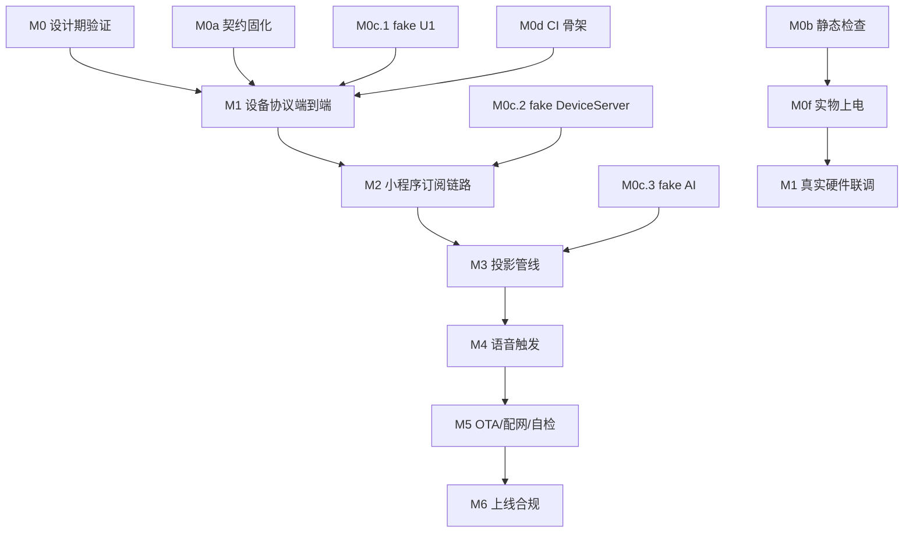
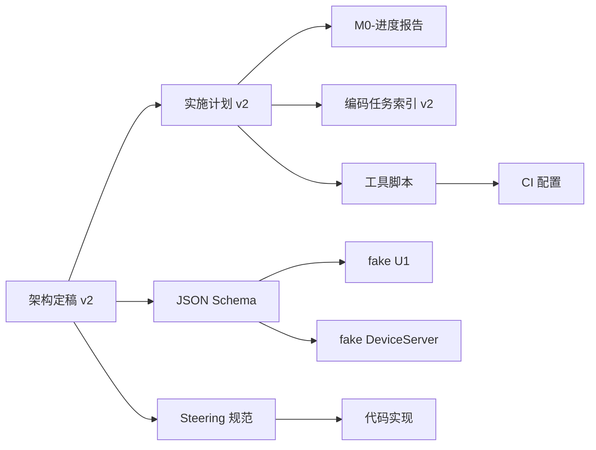
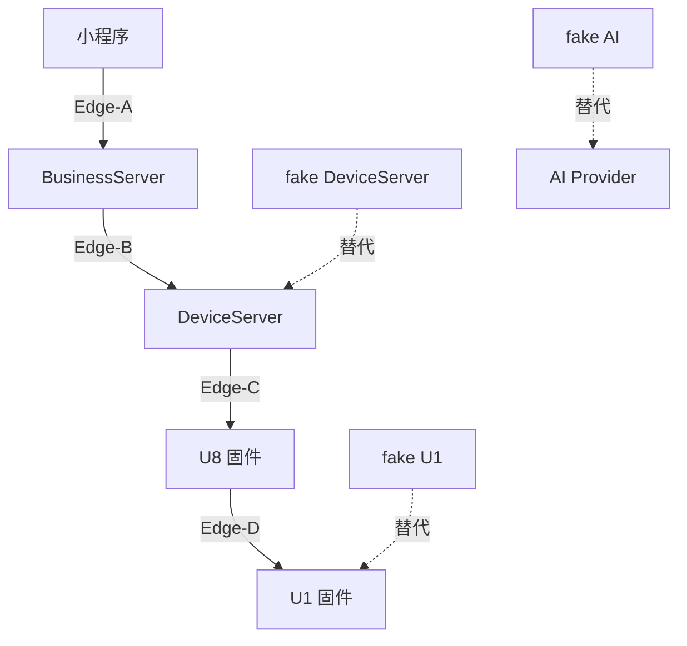

# 全局规划 - Planning with Files

**版本**：v1.0  
**创建日期**：2026-05-14  
**状态**：执行中  
**依据文档**：架构定稿 v2, 实施计划 v2, Superpowers 原则

## 目录

- [1. 项目总览](#1-项目总览)
- [2. 里程碑路线图](#2-里程碑路线图)
- [3. 文件组织结构](#3-文件组织结构)
- [4. 当前进度](#4-当前进度)
- [5. 下一步行动](#5-下一步行动)
- [6. 依赖关系图](#6-依赖关系图)
- [7. 风险与缓解](#7-风险与缓解)

---

## 1. 项目总览

### 1.1 项目定位

**esp32S_XYZ** - 儿童/家庭创意教育智能写字机/画图机

- **商业模式**：硬件买断 + AI 生成能力/字体订阅
- **目标用户**：C 端家庭用户（家长给孩子、成人自购/送礼）
- **客户端**：微信小程序优先
- **核心能力**：写字、画图、语音交互、AI 生成

### 1.2 系统架构

```
Client (小程序)
    ↕ Edge-A (WSS/HTTPS)
BusinessServer (manager-api)
    ↕ Edge-B (内部 HTTP)
DeviceServer (xiaozhi-server)
    ↕ Edge-C (WSS)
U8 (AI_MCU, ESP32-S3)
    ↕ Edge-D (UART @{json}\n)
U1 (MOTOR_MCU, ESP32-S3)
```

### 1.3 核心原则

- **Superpowers 原则**：先验证后实现，尽早收敛不确定性
- **文档先行**：架构定稿 v2 → 实施计划 v2 → 代码实现
- **双重安全裁决**：BusinessServer 前置 + U1 最终裁决
- **代码文档同步**：每次提交必须同时更新文档

---

## 2. 里程碑路线图

### 2.1 总图

```
M0  设计期验证（无主板可做）           ← 当前位置
    M0a ✅ 契约固化（JSON Schema）
    M0b ✅ 静态检查（GPIO 冲突、strapping pin）
    M0c ⏳ 仿真器（fake U1 ✅、fake DeviceServer、fake AI）
    M0d ⏳ CI 与单元测试骨架
    M0e ✅ 基准修复
    M0f ⏸️ 实物上电抽测（等实物）

M1  设备协议端到端 (GET_STATUS/HOME/MOVE)
M2  小程序订阅链路打通 (run_path 可见)
M3  write_text/draw 投影端到端
M4  语音触发 + 声纹
M5  OTA / 配网 / 自检
M6  上线合规与运营级功能
```

### 2.2 里程碑详情

| 里程碑 | 目标 | 前置条件 | 完成判定 | 预计工期 |
|--------|------|----------|----------|----------|
| **M0** | 设计期验证 | 无 | 所有 fake 环境可用，CI 全绿 | 2 周 |
| **M1** | 设备协议端到端 | M0c.1 fake U1 | U8 ↔ U1 三条命令通 | 2 周 |
| **M2** | 小程序订阅链路 | M1 + M0c.2 | 小程序看到设备状态变化 | 3 周 |
| **M3** | 投影管线 | M2 | 写字/画图端到端 | 3 周 |
| **M4** | 语音触发 | M3 + M0c.3 | 语音说话能写字画图 | 2 周 |
| **M5** | OTA/配网/自检 | M4 | 设备可联网、可升级 | 2 周 |
| **M6** | 上线合规 | M5 | 通过小程序审核 | 2 周 |

---

## 3. 文件组织结构

### 3.1 核心文档

```
docs/
├── 架构定稿-v2.md              # 架构规范（P0，所有决策的基准）
├── 实施计划-v2.md              # 实施计划（P0，M0-M6 详细步骤）
├── M0-进度报告.md              # M0 进度跟踪
├── 全局规划-Planning-with-Files.md  # 本文件
├── 编码任务索引-v2.md          # 任务索引
├── ui-template.md              # 小程序 UI 模板选型
├── 硬件连接与GPIO分配说明.md   # 硬件文档
├── 硬件核对报告.md             # 硬件验证
├── U1-Grbl适配说明.md          # U1 固件适配
└── schemas/                    # JSON Schema（M0a）
    ├── README.md
    ├── edge_a/                 # Client ↔ BusinessServer
    ├── edge_b/                 # BusinessServer ↔ DeviceServer
    ├── edge_c/                 # DeviceServer ↔ U8
    └── edge_d/                 # U8 ↔ U1
```

### 3.2 Steering 规范

```
.kiro/steering/
├── README.md                   # Steering 总览
├── ui-ux-pro-max.md           # UI/UX 全局规范
├── code-review.md             # 代码审查规范
├── code-simplifier.md         # 代码简化规范
├── code-doc-sync.md           # 代码文档同步规范
├── skill-creator.md           # 技能创建规范
├── protocol-design.md         # 协议设计 Skill
├── safety-validation.md       # 安全裁决 Skill
├── projection-pipeline.md     # 投影管线 Skill
├── voice-intent.md            # 语音意图 Skill
├── tdd.md                     # 测试驱动开发 Skill
├── fake-environment.md        # fake 环境 Skill
└── milestone-acceptance.md    # 里程碑验收 Skill
```

### 3.3 工具与测试

```
tools/
├── check_gpio.py              # GPIO 静态检查（M0b ✅）
├── test_check_gpio.py         # GPIO 检查单元测试
├── README.md                  # 工具使用文档
└── fake_u1/                   # fake U1 仿真器（M0c.1 ✅）
    ├── fake_u1.py             # 仿真器主程序
    ├── test_fake_u1.py        # 单元测试（13/13 通过）
    └── README.md              # 使用文档
```

### 3.4 固件代码

```
firmware/
├── u1-grbl/                   # U1 固件（Grbl_Esp32）
│   └── Grbl_Esp32/src/
│       ├── Machines/dlc_motor_control_p1.h  # U1 GPIO 配置
│       ├── Report.cpp         # 状态上报（M1.2, M1.3）
│       └── Protocol.cpp       # 私有协议处理（M1.5）
└── u8-xiaozhi/                # U8 固件
    └── main/boards/zhuguang/dlc-motor-control-p1-ai/
        ├── config.h           # U8 GPIO 配置
        └── dlc_motor_control_p1_ai_board.cc  # 板级实现
```

### 3.5 服务端代码

```
server/xiaozhi-esp32-server/main/
├── manager-api/               # BusinessServer (Java/Spring)
│   └── src/main/
│       ├── resources/db/changelog/  # 数据库迁移（M2.1）
│       └── java/.../
│           ├── controller/    # REST API（M2.2）
│           ├── service/       # 业务逻辑
│           └── ws/            # WebSocket（M2.7）
├── xiaozhi-server/            # DeviceServer (Python)
│   └── core/
│       ├── handle/            # 消息处理（M2.4）
│       ├── api/               # HTTP API
│       └── websocket_server.py  # WSS 服务器
└── manager-mobile/            # 小程序 (uni-app)
    └── src/
        ├── pages/             # 页面（M2.8）
        └── utils/             # 工具函数
```

---

## 4. 当前进度

### 4.1 已完成（✅）

#### M0a 契约固化
- ✅ `docs/schemas/` 全部 schema 文件
- ✅ Edge-A/B/C/D 四条边界的协议定义
- ✅ 每条 capability、event、命令、响应都有 schema

#### M0b 静态检查
- ✅ `tools/check_gpio.py` - GPIO 静态检查工具
- ✅ `tools/test_check_gpio.py` - 8/8 单元测试通过
- ✅ 真实配置检查通过（0 错误，0 警告，3 信息）
- ✅ 修复 GPIO38/39/40 误判问题
- ✅ 改进 strapping pin 检查逻辑

#### M0c.1 fake U1
- ✅ `tools/fake_u1/fake_u1.py` - 仿真器主程序
- ✅ `tools/fake_u1/test_fake_u1.py` - 13/13 单元测试通过
- ✅ 完整状态机（7 种状态）
- ✅ 10 种命令支持
- ✅ 4 种错误注入

#### M0e 基准修复
- ✅ U8 config.h TX/RX 修复
- ✅ 硬件文档证据强度标注
- ✅ v1 文档失效声明

### 4.2 进行中（⏳）

#### M0c.2 fake DeviceServer
- ⏳ 待实现
- 优先级：P2（BusinessServer 端开发依赖）

#### M0c.3 fake AI provider
- ⏳ 待实现
- 优先级：P2（M3/M4 开发依赖）

#### M0d CI 与单元测试骨架
- ✅ `.github/workflows/ci.yml` - CI 配置骨架
- ✅ `gpio-check` job - GPIO 静态检查
- ✅ `python-unit` job - Python 单元测试
- ✅ `schema-validate` job - JSON Schema 校验
- ✅ `fake-integration` job - Fake 环境集成测试
- ✅ `markdown-link-check` job - Markdown 链接检查

### 4.3 等待中（⏸️）

#### M0f 实物上电抽测
- ⏸️ 等实物，不阻塞 M1~M3 软件设计
- 作为 M1 进入"真实硬件联调"的强前置

---

## 5. 下一步行动

### 5.1 立即执行（P0）

**无** - 当前所有 P0 任务已完成

### 5.2 短期计划（P1）

#### 1. 完善 M0d CI（预计 2 天）

**目标**：让 GitHub Actions 24 小时守护代码质量

**任务**：
- [x] 实现 `schema-validate` job
  - 文件：`.github/workflows/ci.yml`
  - 工具：`jsonschema` 库
  - 校验：`docs/schemas/` 全部样例
  
- [x] 实现 `fake-integration` job
  - 用 fake U1 跑端到端集成测试
  - 覆盖：GET_STATUS/HOME/MOVE/run_path 各 1 条 happy path
  
- [x] 实现 `markdown-link-check` job
  - 保证 v2 文档内部锚点不腐坏
  
- [ ] 配置 GitHub required checks
  - PR 必须 5 个 job 全绿才可合并

**完成判定**：
- ✅ 本地等价 CI 命令全绿
- [ ] GitHub main 分支 CI 全绿
- [ ] PR 有 required check 保护

#### 2. 准备 M1 开发环境（预计 1 天）

**目标**：为 M1 设备协议端到端做准备

**任务**：
- [ ] 验证 fake U1 与 U8 的连接
  - 启动 fake U1 服务器
  - 配置 U8 连接到 fake U1
  - 发送测试命令
  
- [ ] 准备 M1.1 Edge-D 样例集
  - 已有：`docs/schemas/edge_d/examples/` 7 个样例
  - 验证：fake U1 与 U8 单测都引用同一批样例

**完成判定**：
- ✅ U8 能连接到 fake U1
- ✅ 能发送 GET_STATUS 并收到响应

### 5.3 中期计划（P2）

#### 3. 实现 M0c.2 fake DeviceServer（预计 3 天）

**目标**：让 BusinessServer 端开发不必等真 xiaozhi-server 改造

**任务**：
- [ ] 创建 `tools/fake_device_server/` 目录
- [ ] 实现最小 WebSocket server
- [ ] 实现 HTTP 接收 motion_task
- [ ] 转发给 fake U1
- [ ] 反向上报 motion_event

**完成判定**：
- ✅ BusinessServer 端单元测试用它做集成 fake
- ✅ 不依赖真 Python 上游

#### 4. 实现 M0c.3 fake AI provider（预计 2 天）

**目标**：M3/M4 阶段不依赖真 LLM/ASR/TTS

**任务**：
- [ ] 创建 `tools/fake_ai/` 目录
- [ ] 固定回包模拟 LLM
- [ ] 固定文字模拟 ASR
- [ ] 静默音频模拟 TTS

**完成判定**：
- ✅ DeviceServer 在 ai_plan = `plan_basic` 时调它而非真实 provider

---

## 6. 依赖关系图

### 6.1 里程碑依赖



### 6.2 文件依赖



### 6.3 代码依赖



---

## 7. 风险与缓解

### 7.1 高风险（需立即关注）

| 风险 | 概率 | 影响 | 当前状态 | 缓解措施 |
|------|------|------|----------|----------|
| 主板到货延迟压缩 M4~M6 时间 | 中 | 中 | ⚠️ 监控中 | ✅ M1~M3 全在仿真器上推进，避免软件轨被硬件阻塞 |
| U1 弱证 GPIO 实测发现错位 | 中 | 高 | ⚠️ 等 M0f | ✅ M0b 工具已实现，M0f 上板时验证 |
| JSON Schema 与实现漂移 | 中 | 中 | ⚠️ 需 CI | ⏳ M0d CI 校验 schema；v2 §19.5 字段演进规则强制"先 schema 后代码" |

### 7.2 中风险（需定期检查）

| 风险 | 概率 | 影响 | 当前状态 | 缓解措施 |
|------|------|------|----------|----------|
| fake U1 与真实 U1 行为偏差 | 中 | 中 | ✅ 已记录 | M0c.1 fake 只保留协议行为，禁止仿真真实电机物理；M0f 上板当天列"首次实机清单"交叉验证 |
| Grbl_Esp32 内部 API 与预期不符 | 中 | 中 | ⚠️ 待验证 | M1.1 时先写 dryrun 探测 |
| 微信小程序审核被打回 | 中 | 高 | ⏸️ M6 | M6.1 提前一个月开始 |

### 7.3 低风险（已缓解）

| 风险 | 概率 | 影响 | 当前状态 | 缓解措施 |
|------|------|------|----------|----------|
| GPIO 配置错误导致硬件损坏 | 低 | 高 | ✅ 已缓解 | M0b 工具已实现，可提前发现 |
| 内容审核服务出问题 | 低 | 高 | ⏸️ M3 | 双层（本地关键词 + 云端语义） |
| 声纹模型对儿童识别率低 | 高 | 中 | ⏸️ M4 | v2 §6ter.8 6 个月重录 + 失败降级 |
| OTA 灰度遇大面积失败 | 中 | 极高 | ⏸️ M5 | 灰度上限 10% 起，监控见错就停 |

---

## 8. 关键指标

### 8.1 进度指标

| 指标 | 当前值 | 目标值 | 状态 |
|------|--------|--------|------|
| M0 完成度 | 70% | 100% | ⏳ 进行中 |
| M0a 契约固化 | 100% | 100% | ✅ 完成 |
| M0b 静态检查 | 100% | 100% | ✅ 完成 |
| M0c 仿真器 | 33% | 100% | ⏳ 进行中 |
| M0d CI 骨架 | 80% | 100% | ⏳ 等 GitHub required checks |
| M0e 基准修复 | 100% | 100% | ✅ 完成 |
| M0f 实物抽测 | 0% | 100% | ⏸️ 等实物 |

### 8.2 质量指标

| 指标 | 当前值 | 目标值 | 状态 |
|------|--------|--------|------|
| GPIO 检查通过率 | 100% | 100% | ✅ 达标 |
| fake U1 测试通过率 | 100% (13/13) | 100% | ✅ 达标 |
| CI 通过率 | 60% (3/5 jobs) | 100% | ⏳ 改进中 |
| 文档同步率 | 100% | 100% | ✅ 达标 |

### 8.3 效率指标

| 指标 | 当前值 | 目标值 | 状态 |
|------|--------|--------|------|
| 代码提交频率 | 每天 2-3 次 | 每天 2-3 次 | ✅ 达标 |
| 文档更新延迟 | 0 天 | 0 天 | ✅ 达标 |
| PR 合并时间 | N/A | < 1 天 | - |
| CI 执行时间 | ~2 分钟 | < 5 分钟 | ✅ 达标 |

---

## 9. 团队协作

### 9.1 角色与职责

| 角色 | 职责 | 当前状态 |
|------|------|----------|
| 架构师 | 维护架构定稿 v2，审查重大变更 | ✅ 活跃 |
| 开发者 | 实现代码，遵循 Steering 规范 | ✅ 活跃 |
| 测试者 | 编写单元测试，执行集成测试 | ✅ 活跃 |
| 文档维护者 | 同步更新文档，保持文档新鲜 | ✅ 活跃 |

### 9.2 沟通机制

- **日常沟通**：通过 Git commit message 和 PR 描述
- **重大决策**：更新架构定稿 v2，添加修订记录
- **进度同步**：更新 M0-进度报告.md
- **问题跟踪**：GitHub Issues（待建立）

### 9.3 代码审查清单

参考 `.kiro/steering/code-review.md`：

- [ ] 角色职责正确（§2 五角色表）
- [ ] 分层正确，无跨层直连（§3.2）
- [ ] 双重安全裁决生效（§10bis）
- [ ] 协议字段符合 schema
- [ ] 文档已同步更新
- [ ] 测试已通过

---

## 10. 参考资料

### 10.1 核心文档

- **架构定稿 v2**：`docs/架构定稿-v2.md`
- **实施计划 v2**：`docs/实施计划-v2.md`
- **Superpowers 原则**：`.cursor/rules/superpowers-and-context.mdc`
- **M0 进度报告**：`docs/M0-进度报告.md`

### 10.2 Steering 规范

- **UI/UX 规范**：`.kiro/steering/ui-ux-pro-max.md`
- **代码审查规范**：`.kiro/steering/code-review.md`
- **代码简化规范**：`.kiro/steering/code-simplifier.md`
- **代码文档同步**：`.kiro/steering/code-doc-sync.md`

### 10.3 技能库

- **协议设计**：`.kiro/steering/protocol-design.md`
- **安全裁决**：`.kiro/steering/safety-validation.md`
- **投影管线**：`.kiro/steering/projection-pipeline.md`
- **语音意图**：`.kiro/steering/voice-intent.md`
- **TDD**：`.kiro/steering/tdd.md`
- **fake 环境**：`.kiro/steering/fake-environment.md`
- **里程碑验收**：`.kiro/steering/milestone-acceptance.md`

### 10.4 工具文档

- **GPIO 检查工具**：`tools/README.md`
- **fake U1 使用**：`tools/fake_u1/README.md`

---

## 11. 修订记录

- 2026-05-14：初始版本，整合 M0 阶段所有文件与进度
- 2026-05-14 (晚上)：添加 M0c.1 fake U1 完成状态

---

## 附录 A：快速导航

### A.1 我想...

- **了解项目架构** → `docs/架构定稿-v2.md`
- **查看实施计划** → `docs/实施计划-v2.md`
- **查看当前进度** → `docs/M0-进度报告.md`
- **查看全局规划** → `docs/全局规划-Planning-with-Files.md`（本文件）
- **查看 JSON Schema** → `docs/schemas/README.md`
- **使用 GPIO 检查工具** → `tools/README.md`
- **使用 fake U1** → `tools/fake_u1/README.md`
- **查看 Steering 规范** → `.kiro/steering/README.md`

### A.2 我要做...

- **开始新功能开发** → 先读 `架构定稿 v2` 相关章节 → 再读 `实施计划 v2` 对应 M.x → 再查 `Steering 规范`
- **修复 Bug** → 先读 `code-simplifier.md` → 再写测试 → 再修复 → 再更新文档
- **提交代码** → 先跑测试 → 再更新文档 → 再提交（遵循 `code-doc-sync.md`）
- **审查代码** → 使用 `code-review.md` 检查清单
- **创建新 Skill** → 参考 `skill-creator.md`

### A.3 我遇到...

- **GPIO 配置问题** → 运行 `python tools/check_gpio.py`
- **协议不确定** → 查看 `docs/schemas/` 对应边界
- **需要测试环境** → 使用 `tools/fake_u1/`
- **文档不同步** → 参考 `code-doc-sync.md` 修复
- **不知道下一步** → 查看本文件 §5 下一步行动

---

**END OF DOCUMENT**
